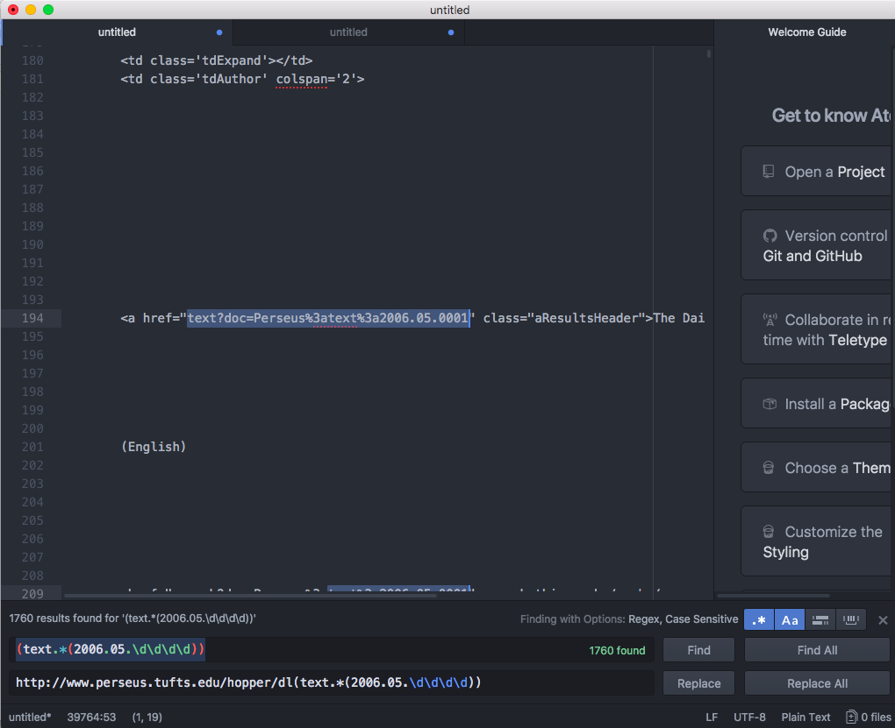
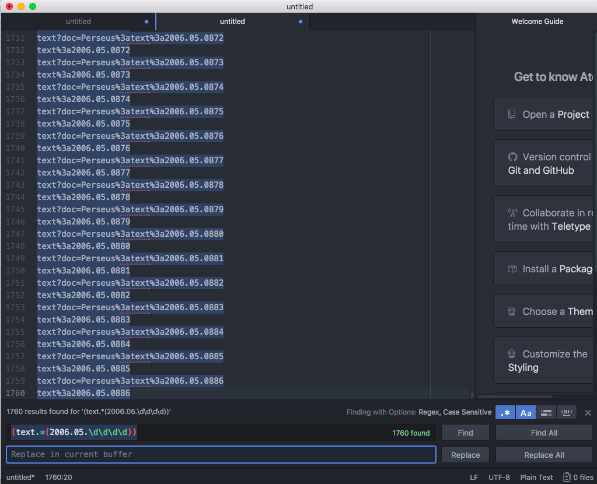

How it's done:

Steps:
* I opened the html code of the site and looked for the link to the article that I want to download later on.

* Copy/pasted the entire html-code into my texteditor.

* Using Regular Expressions, I extracted the link(s) to the article(s). 

* Then inserted the rest of the link, so I could download it.

* Downloaded the files via Wget.
